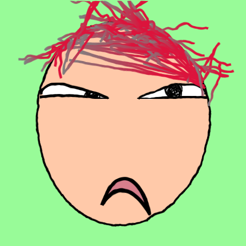

# hello_avatar

轻松搭建生成简易头像的api服务

# 安装

```
docker-compose up -d
```

# 使用

访问示例页面
> http://localhost:13130/

> 访问接口：

> http://localhost:13130/avatar

接口将返回png图片内容，尺寸为500*500

参数控制：

| 字段    | 是否必填 | 类型     | 简介                                                                                                                                                                                                                                               |
|-------|------|--------|--------------------------------------------------------------------------------------------------------------------------------------------------------------------------------------------------------------------------------------------------|
| type  | 否    | string | 生成头像类型，<br/>ugly-avatar-丑头像（默认），参考：https://github.com/txstc55/ugly-avatar<br/>multiavatar-插画头像，参考：https://multiavatar.com/<br/>jdenticon-随机头像，参考：https://jdenticon.com/icon-designer.html <br/>dicebear-风格头像，参考：https://www.dicebear.com/styles/ |
| style | 否    | string | 风格类型，仅当type=dicebear时有效<br/>male-男性风格<br/>female-女性风格<br/>avataaars-由Avataaars设计的头像<br/>bottts-像素机器人<br/>gridy-棋盘格式风格<br/>human-贴近真实人类样貌<br/>identicon-GitHub使用的Identicons风格的头像<br/>initials-显示用户初始字母的简单风格                                       |
| seed  | 否    | string | 头像生成种子变量，仅当type=dicebear且style=initials时有效                                                                                                                                                                                                       |

# 参考图片

> type=ugly-avatar



> type=multiavatar


> type=jdenticon


> type=dicebear

| 风格类型+种子变量 | male                     | female                   | avataaars                | bottts                   | gridy                    | human                    | identicon                 | initials+测试               |
|-----------|--------------------------|--------------------------|--------------------------|--------------------------|--------------------------|--------------------------|---------------------------|---------------------------|
| 示例        |  |  |  |  |  |  |  |  |
